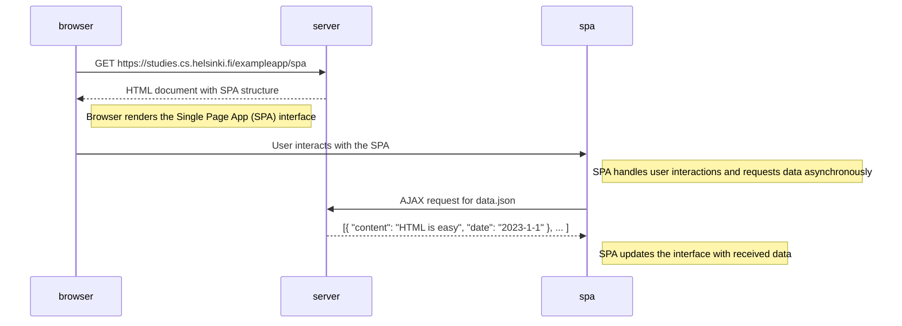

```mermaid
sequenceDiagram
    participant browser
    participant server
    participant spa
    
    browser->>server: GET https://studies.cs.helsinki.fi/exampleapp/spa
    server-->>browser: HTML document with SPA structure
    
    Note right of browser: Browser renders the Single Page App (SPA) interface
    
    browser->>spa: User interacts with the SPA
    
    Note right of spa: SPA handles user interactions and requests data asynchronously
    
    spa->>server: AJAX request for data.json
    server-->>spa: [{ "content": "HTML is easy", "date": "2023-1-1" }, ... ]
    
    Note right of spa: SPA updates the interface with received data
```
